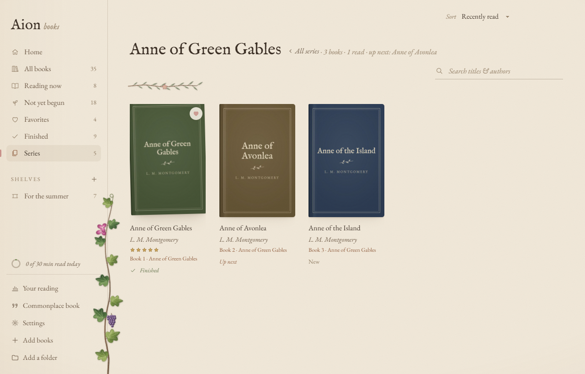

<h1 align="center">Aion Books</h1>

<p align="center">
  <em>A free, quiet, paper-textured e-book reader and library for Windows —<br>EPUB, Kindle (MOBI / AZW3), PDF, comics (CBZ) and FB2.</em>
</p>

<p align="center">
  <a href="https://github.com/TheGreatAion/aion-books/releases/latest"><b>Download for Windows</b></a>
  &nbsp;·&nbsp;
  <a href="https://thegreataion.github.io/aion-books/">Website</a>
  &nbsp;·&nbsp;
  <a href="#features">Features</a>
  &nbsp;·&nbsp;
  <a href="#building-from-source">Build from source</a>
</p>

<p align="center">
  
</p>

Aion Books is a home for your book collection and a calm place to read it. Pages feel like lightly
weathered paper, a few painted botanicals — ivy, lemons, olive — grow in the margins, and everything
else stays out of the way of the words.

It's a free, open-source e-book reader for Windows that opens **EPUB, Kindle (MOBI and AZW3), PDF,
comic book (CBZ) and FictionBook (FB2)** files, keeps them in one library sorted into series and
shelves, and works entirely offline — no account, no subscription, no tracking.

## Download

1. Grab **`Aion-Books-Setup-x.y.z.exe`** from the [latest release](https://github.com/TheGreatAion/aion-books/releases/latest).
2. Run it. Windows may say the publisher is unknown (the installer isn't code-signed) — choose
   **More info → Run anyway**.
3. Drop some books onto the window — EPUB, Kindle (MOBI, AZW3), PDF, comics (CBZ) or FictionBook (FB2) — and start reading.

Installed copies keep themselves up to date: new versions download in the background and install the
next time you restart.

## Supported formats

| Format | Extensions | Notes |
| --- | --- | --- |
| EPUB | `.epub` | Reflowable and fixed-layout EPUB 2 and 3 |
| Kindle | `.mobi`, `.azw3`, `.azw`, `.prc` | Books without DRM |
| PDF | `.pdf` | Pages shown as they were printed |
| Comics | `.cbz` | A page at a time, or two side by side |
| FictionBook | `.fb2`, `.fbz` | Common for Russian-language books; plain or zipped |

Books bought from a store with DRM (copy protection) can't be opened — the same as with any reader
that isn't the store's own.

## Features

### Your library
- **Shelves, favorites and series.** Books in a series are grouped and shown in reading order, with the ones you
  don’t have yet marked where they fall, and when you finish one, the next is waiting for you.
- **Series found for you:** books whose files don’t say which series they’re in are looked up on
  [Wikidata](https://www.wikidata.org) (only the title and author are sent), and what’s found waits for your
  review. You can also set, rename, renumber or remove a series yourself.
- **Continue reading** — your current book up front, with every other book in progress beneath it.
- **Star ratings**, search, and sorting — including your own order, arranged by dragging books around.
- **Custom covers**, editable titles and authors.
- **Tidy titles:** ISBNs, Kindle tags and repeated series numbers come off titles, and a title that names its series puts the book in it. Older books can be reviewed in Settings, and every original title can be restored.
- **Choose several books** with Ctrl- or Shift-click to shelve, finish, favorite or remove them together. Removing shows **Undo** instead of asking first. Arrow keys move around the shelf.
- **A watched folder** — save a book into it and it appears in your library on its own.

<p align="center">
  
</p>

### Reading
- **EPUB, Kindle (MOBI / AZW3), PDF, comics (CBZ) and FictionBook (FB2)**, all in the same reader.
- **A real page curl** as you turn, and **page edges** either side that show how far through the book you are.
- **Single page, two-page spread, or continuous scroll**, with a choice of typefaces — or add your own
  `.ttf`, `.otf`, `.woff` or `.woff2` fonts.
- **Search inside the book**, **footnote pop-ups**, and a **dictionary** for any word you select.
- **Who is this?** Select a character's name to see where they were first mentioned and where you last saw
  them, from the pages you've already read, and from the earlier books in the series. It only ever looks
  back, so it can't spoil anything. Wikipedia is there too, if you ask, with a warning that it may.
- **Read aloud** with the voices built into Windows, following along sentence by sentence.
- **Highlights, notes and bookmarks**, exportable to Markdown.
- **Time left** in the chapter and the book, learned from how fast you actually read — or pages left, or
  just the percentage.
- Three papers — **Linen**, **Parchment** and **Dusk** — plus spacing, margins and size controls.
- **Dusk when Windows is dark**, if you like: it follows Windows’ light and dark mode.
- **Back to where you were:** after a jump to the contents, a search result, a footnote or a bookmark, one click takes you back. Dragging the progress bar shows which chapter you’d land in.

<p align="center">
  
</p>

### Your commonplace book
Every passage you've highlighted, from every book, gathered on one page with your notes beside them —
searchable, sorted by book or by date, with one at random at the top. Click a passage to open the book
right there.

### Your reading
Its own page in the sidebar: a year in books, month by month — what you finished, how long each took and
how you rated it — plus time spent reading, streaks, pages turned, a fourteen-day chart, your most-read books, and a daily
reading goal that fills a small ring in the sidebar.

<p align="center">
  
</p>

### Your data stays yours
- Everything lives in one folder on your PC. **Back up and restore** the whole library — books,
  progress, highlights, shelves and fonts — as a single file.
- Put the library in a **OneDrive or Dropbox** folder to share it, and your reading progress, between PCs.
- No accounts and no tracking. The only times Aion Books goes online are when you look up a word
  (via [Wiktionary](https://en.wiktionary.org)) or a character on Wikipedia, when it looks up a new book’s series on Wikidata, and when it checks GitHub for updates — which you can
  turn off in Settings.

<p align="center">
  
</p>

## Questions

**Is Aion Books free?** Yes — free and open source, under the MIT license. No ads, no account, no
in-app purchases.

**Can it read Kindle books?** Kindle files (MOBI, AZW3) without DRM, yes. Books still locked to
Amazon's apps can't be opened.

**Does it work offline?** Completely. It only goes online when you look up a word, a character or a
book's series, and to check for updates — each of which you can turn off or simply not use.

**Is there a Mac or Linux version?** Not yet: Aion Books is made for Windows 10 and 11. It's built on
Electron, so other systems are possible later.

**Where are my books kept?** In one folder on your PC (`%APPDATA%\Aion Books`), which you can move —
to a OneDrive or Dropbox folder, say, to share your library and reading progress between PCs.

## Keyboard shortcuts

| Where    | Keys                              | Does                          |
| -------- | --------------------------------- | ----------------------------- |
| Library  | <kbd>Ctrl</kbd>+<kbd>O</kbd>      | Add books                     |
| Library  | <kbd>Ctrl</kbd>+<kbd>F</kbd> or <kbd>/</kbd> | Search your library |
| Anywhere | <kbd>Ctrl</kbd>+<kbd>,</kbd>      | Settings                      |
| Anywhere | <kbd>?</kbd>                      | Show these shortcuts          |
| Reader   | <kbd>←</kbd> <kbd>→</kbd>, <kbd>PgUp</kbd> <kbd>PgDn</kbd>, <kbd>Space</kbd>, mouse wheel | Turn pages |
| Reader   | <kbd>Ctrl</kbd>+<kbd>F</kbd>      | Search this book              |
| Reader   | <kbd>R</kbd>                      | Read aloud — play / pause     |
| Reader   | <kbd>T</kbd>                      | Contents & notes              |
| Reader   | <kbd>B</kbd>                      | Bookmark this page            |
| Reader   | <kbd>Ctrl</kbd>+<kbd>+</kbd> / <kbd>Ctrl</kbd>+<kbd>−</kbd> | Text size  |
| Reader   | <kbd>F11</kbd>                    | Full screen                   |
| Reader   | <kbd>Esc</kbd>                    | Close a panel, then back to the library |

## Building from source

You'll need [Node.js](https://nodejs.org) 20 or newer.

```
git clone https://github.com/TheGreatAion/aion-books.git
cd aion-books
npm install
npm start
```

| Command           | What it does                                                        |
| ----------------- | ------------------------------------------------------------------- |
| `npm start`       | Run the app from source                                             |
| `npm test`        | Run the unit tests and the app tests                                |
| `npm run pack`    | Build an unpacked copy → `release/win-unpacked/Aion Books.exe`      |
| `npm run dist`    | Build the installer → `release/Aion-Books-Setup-x.y.z.exe`          |
| `npm run release` | Build the installer and publish it as a GitHub release (needs `gh auth login`) |

Close any running copy before building — it locks `release/win-unpacked`.

To publish a new version: bump `version` in `package.json`, commit and push, then run `npm run release`.
Installed copies pick it up automatically.

### How it's put together

| Path                     | What's there                                                              |
| ------------------------ | ------------------------------------------------------------------------- |
| `main.js`                | The window, library storage, importing, watched folder, backups, sync, updates |
| `preload.js`             | The bridge between the app window and the main process                    |
| `lib/`                   | EPUB metadata (including series), book formats, the JSON store, bundled and custom fonts |
| `src/library.js`         | Shelves, the book grid, details, ratings, drag-to-reorder                 |
| `src/reader.js`, `src/reader-extras.js` | The reader: styling, controls, highlights, search, read aloud, footnotes, time left |
| `src/vendor/foliate-js/` | The book engine, [foliate-js](https://github.com/johnfactotum/foliate-js) (MIT), included unmodified |
| `tests/`                 | Unit tests, and app tests that drive the real app against generated sample books |
| `src/settings.js`        | Settings, the Your reading page, and the shortcuts list                    |
| `src/who.js`             | Who is this? — where you've met a character before                       |
| `src/journal.js`         | The commonplace book and the reading timeline                             |
| `src/page-curl.js`       | The page curl                                                             |
| `src/painted.js`         | The painted botanical artwork, drawn as SVG                               |
| `src/styles.css`         | Everything visual                                                         |

By default your library is stored in `%APPDATA%\Aion Books`. **Settings → Your data → Library location**
can move it.

## Thanks

Books are laid out by [foliate-js](https://github.com/johnfactotum/foliate-js) by John Factotum,
the engine behind the [Foliate](https://johnfactotum.github.io/foliate/) reader.

## License

[MIT](LICENSE) © TheGreatAion
